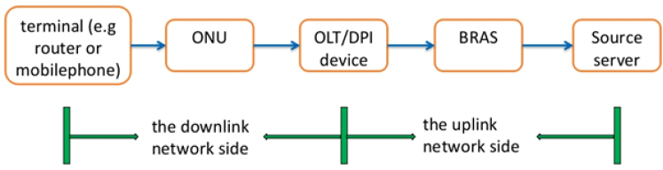
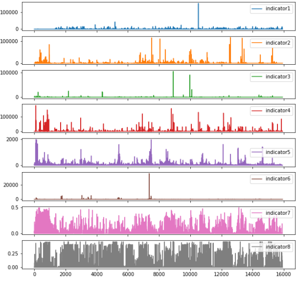
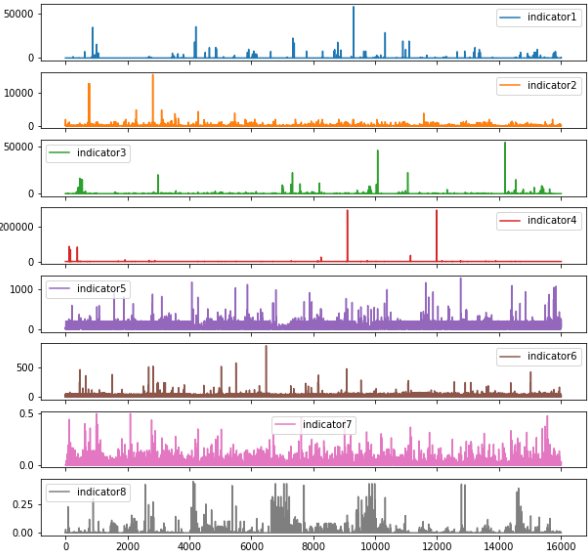
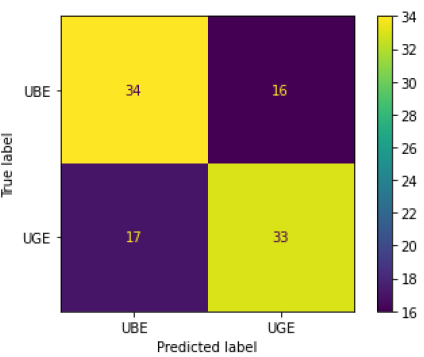

# Enhancing User Experience in Home Networks with Machine Learning-Based Classification

This repository contains the code and models for our paper "Enhancing User Experience in Home Networks with Machine Learning-Based Classification", published in the ITU Journal on Future and Evolving Technologies. This work won the Best Student Solution Award in the 2022 ITU AI/ML in 5G Challenge.

## Abstract

Our novel time series characteristic-based method extracts thousands of descriptive statistics from time series sequences, achieving an impressive 67% validation accuracy. This represents a substantial 3% enhancement over the performance of conventional models on this dataset. We also explored the potential of a Recurrent Neural Network (RNN) model, which yielded promising results with a validation accuracy of 58%.

<p align="center">
  
  <br>
  <em>Figure 1: Overview of the downlink network side architecture</em>
</p>

## Table of Contents

1. [Introduction](#introduction)
2. [Dataset](#dataset)
3. [Methodology](#methodology)
4. [Results](#results)
5. [Repository Structure](#repository-structure)
6. [Installation and Usage](#installation-and-usage)
7. [Acknowledgements](#acknowledgements)
8. [Citation](#citation)

## Introduction

With the rapid development of mobile Internet, home broadband quality has become a key factor in determining market competitiveness. This project aims to develop an efficient machine learning model to accurately evaluate home user network experiences, enabling network operators to proactively identify potential dissatisfied users and implement timely corrective measures.

## Dataset

The dataset, provided by ZTE, encompasses network indicator data from 500 anonymized users. It presents several challenges:

- Non-standard sampling rate and time range
- Uneven distribution of observations
- Multiple recorded observations for identical timestamps
- Constrained sample size
- Subjective definition of Internet experience
- Lack of essential information regarding the data collection setup

<table>
  <tr>
    <th>UBE Indicators</th>
    <th>UGE Indicators</th>
  </tr>
  <tr>
    <td width="50%">
      
      <p align="center">
        <em>Figure 2a: Network indicators for users reporting bad experience. Note the higher frequency and amplitude of spikes across multiple indicators.</em>
      </p>
    </td>
    <td width="50%">
      
      <p align="center">
        <em>Figure 2b: Network indicators for users reporting good experience. Observe the generally lower and more stable indicator values.</em>
      </p>
    </td>
  </tr>
</table>

## Methodology

We explored various machine learning approaches:

1. Traditional MTSC (Multivariate Time Series Classification) models:
   - ROCKET classifier
   - DTW-KNN
   - HIVE-COTE

2. Deep Learning models:
   - Convolutional Neural Networks (CNN)
   - Long Short-Term Memory (LSTM) Networks

3. Time Series Characteristic (TS-Char) models:
   - Manual feature extraction + XGBoost
   - TSFresh + PCA + XGBoost

## Results

Our TSFresh + XGBoost model achieved the highest performance with 67% validation accuracy, outperforming other approaches in the 2022 ITU AI/ML in 5G Challenge. The LSTM model also showed promise with 58% accuracy.

<p align="center">
  
  <br>
  <em>Figure 10: TSFresh + XGBoost model confusion matrix</em>
</p>

## Repository Structure
```
├── models/               # Trained models
│   ├── rnn_checkpoint/  # Best RNN checkpoint
│   └── xgboost_model/   # TSFresh + PCA + XGBoost model
├── notebooks/           # Implementation notebooks
│   ├── rocket.ipynb    # ROCKET classifier implementation
│   ├── lstm_rnn.ipynb  # LSTM RNN implementation
│   ├── manual_features.ipynb  # Manual feature extraction
│   ├── tsfresh.ipynb   # TSFresh + PCA + XGBoost
│   └── ts_regularization.ipynb # Data preprocessing
├── requirements.txt    # Dependencies
└── docs/              # Documentation and paper
```

## Installation and Usage

1. Clone this repository
2. Download the competition data from [this Google Drive link](https://drive.google.com/file/d/1LUT96tVeihO8YIZAPBPL3suLUFj4H2W3/view?usp=sharing) and unzip it in the repository root
3. Install the required packages: `pip install -r requirements.txt`
4. Navigate to the `notebooks/` directory to run the Jupyter notebooks

Note: A GPU is highly recommended for running the LSTM RNN notebook.

## Acknowledgements

We would like to thank ITU for organizing the 2022 AI/ML in 5G Challenge and ZTE for providing the problem statement and dataset. Special thanks to the Telecommunication Standardization Bureau (TSB) of ITU for their support and collaboration in co-authoring the research paper.

## Citation
If you use this code or our findings in your research, please cite:
```
@article{rai2024enhancing,
  title={Enhancing User Experience in Home Networks with Machine Learning-Based Classification},
  author={Rai, Rushat and Basikolo, Thomas},
  journal={ITU Journal on Future and Evolving Technologies},
  volume={5},
  number={1},
  year={2024},
  publisher={International Telecommunication Union}
}
```

## License
This project is licensed under CC BY-NC-ND 3.0 IGO.

---
This research has been published in the ITU Journal on Future and Evolving Technologies, Volume 5, Issue 1, March 2024. For more details, please refer to the full paper: [Enhancing User Experience in Home Networks with Machine Learning-Based Classification](https://www.itu.int/pub/S-JNL-VOL5.ISSUE1-2024-A12)
